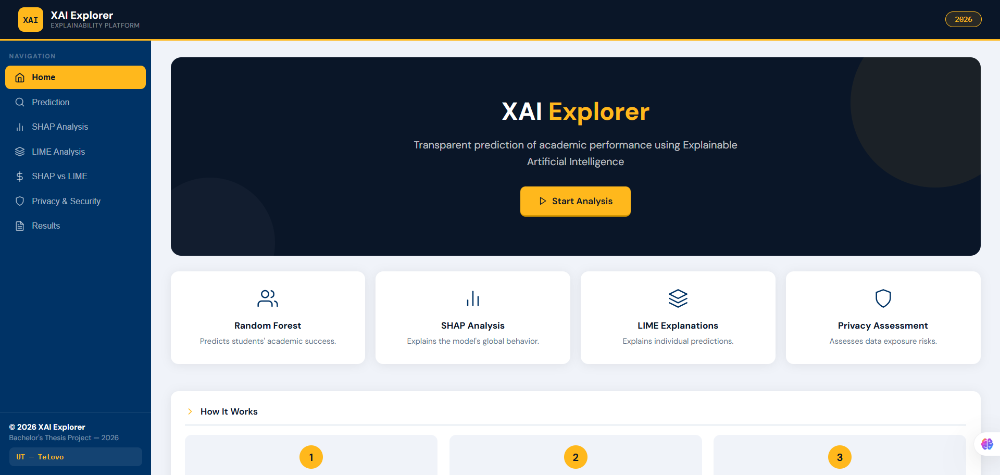
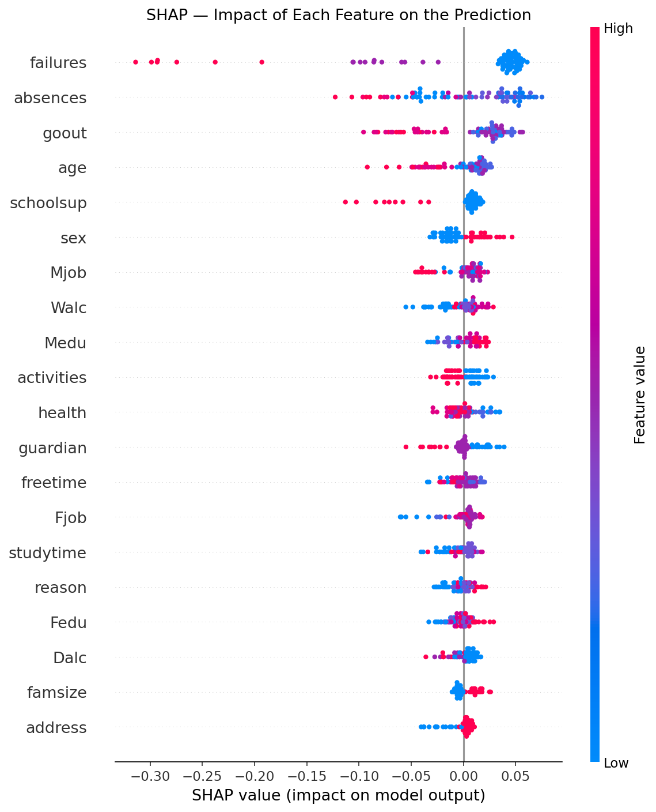
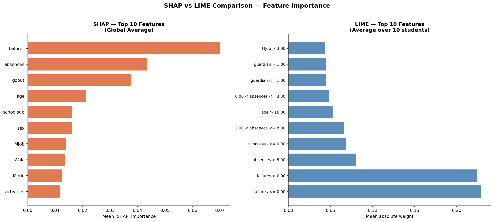
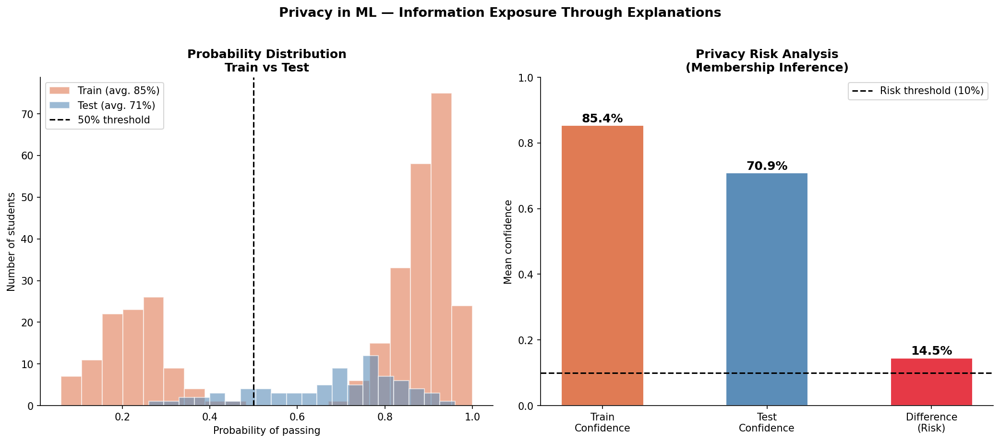

# XAI Explorer

**Comparing SHAP and LIME explainability methods on a student performance prediction model — with an integrated privacy-risk analysis layer.**

[](https://xai-explorer-cuwv.onrender.com)
[](LICENSE)
[](https://www.python.org/)

**Live demo:** https://xai-explorer-cuwv.onrender.com

---

## Overview

XAI Explorer is a Flask-based web platform built as part of a diploma thesis on explainability and security in Machine Learning ("Shpjegueshmëria dhe Siguria në Machine Learning", University of Tetova, supervised by Prof. Dr. Florim Idrizi). The platform trains a Random Forest classifier on the UCI Student Performance dataset and lets users interactively compare how SHAP and LIME explain the same predictions — while also surfacing what those explanations reveal about privacy risk.

Most XAI tools stop at "here is which features mattered." This project goes a step further and asks: **what does an explanation leak about the data it was trained on, and does it matter which explainability method you trust?**

## Key Highlights

- **Global vs. local explainability compared side by side** — SHAP (TreeExplainer) and LIME (LimeTabularExplainer) are run on the same model and the same predictions, so their outputs can be directly compared rather than evaluated in isolation.
- **SHAP and LIME agree on direction, diverge on magnitude.** Across the top features, both methods point the same way most of the time — but the size of the effect they report can differ substantially, which has real implications for which method you'd trust in a high-stakes setting.
- **Diagnosed and corrected a class-imbalance issue.** The baseline model's accuracy matched a naive majority-class baseline, masking real discriminative signal (AUC-ROC = 0.648). Retraining with `class_weight='balanced'` improved both accuracy and minority-class F1-score — the full diagnosis-to-fix workflow is documented in the analysis notebook.
- **Original contribution — Feature Risk Score:** a metric derived from SHAP's global importance values, used to flag which features carry the most explanatory (and therefore privacy-relevant) weight.
- **Original contribution — Membership Inference Attack simulation:** the platform compares the model's confidence on training vs. test data to simulate how easily an attacker could infer whether a specific record was used to train the model — turning an abstract privacy concept into something visible and interactive.
- Built as a 7-page Flask application, with all SHAP/LIME plots generated in-memory and served as base64 (no static plot files, faster iteration, no stale images).

## Screenshots









## Methodology

- **Dataset:** UCI Student Performance Dataset (Cortez & Silva), 395 students, 30 features.
- **Task framing:** reformulated from regression (final grade 0–20) to binary classification (pass/fail, threshold ≥10), with an 80/20 stratified split.
- **Model:** Random Forest Classifier (scikit-learn), trained with `class_weight='balanced'` after diagnosing that the unweighted baseline offered no improvement over a naive majority-class predictor. Stability confirmed via 5-fold cross-validation; hyperparameters checked against a GridSearchCV sweep.
- **Explainability:** SHAP TreeExplainer for global feature importance; LIME for per-instance local explanations, recomputed per request.
- **Full workflow:** see [`notebooks/eda-and-model-training.ipynb`](notebooks/eda-and-model-training.ipynb) for the complete, annotated analysis — including the baseline-vs-final model comparison, cross-validation, hyperparameter search, and a documented discussion of the model's limitations.

## Project Structure
xai-explorer/
├── config.py # Centralized paths, thresholds, parameters
├── ml_pipeline.py # Data prep, model loading, SHAP/LIME logic
├── app.py # Flask routes only (thin controller)
├── notebooks/
│ └── eda-and-model-training.ipynb # Full analysis workflow
├── models/ # Trained model + supporting artifacts
├── data/ # Dataset (UCI Student Performance)
├── templates/index.html # Frontend (vanilla HTML/CSS/JS)
└── docs/screenshots/ # README images


## Tech Stack

**Backend:** Python, Flask, scikit-learn, SHAP, LIME
**Data/Viz:** pandas, NumPy, Matplotlib
**Frontend:** vanilla HTML/CSS/JavaScript (no framework)
**Deployment:** Render

## Running Locally

```bash
git clone https://github.com/remzije-sulejmanoska/xai-explorer.git
cd xai-explorer
pip install -r requirements.txt
python app.py
```

The app will be available at `http://localhost:5000`.

## Author

**Remzije Sulejmanoska**
Computer Science graduate — Machine Learning, Explainable AI & Trustworthy AI
University of Tetova, Faculty of Natural Sciences and Mathematics

## License

This project is licensed under the MIT License — see [LICENSE](LICENSE) for details.